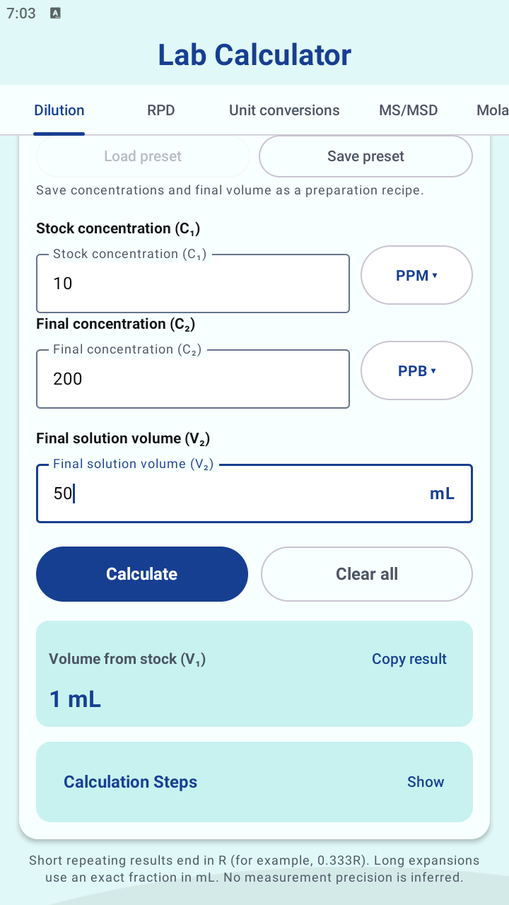

# Lab Calculator

I work in an environmental laboratory and built this Android app for calculations I use or run into at work. It's a small personal tool that keeps them in one place.

It works offline, with no account, analytics, or internet permission. Android 7.0 or newer is required.



*Current development UI running in BlueStacks at 360 × 640, September 30, 2026. Forms scroll to reveal the remaining controls and results.*

## What it does

- **Dilution:** stock volume from C₁V₁ = C₂V₂, with exact PPM/PPB or mg/L/µg/L conversion within the selected concentration family and a copyable preparation instruction. Positive transfers below 1 mL use µL; other transfers, including zero, use mL.
- **RPD:** relative percent difference between a sample and its replicate.
- **Unit conversions:** metric mass, volume, and mass concentration.
- **MS/MSD:** source concentration, spike recoveries, and RPD of the measured MS/MSD results, with one shared PPM, PPB, mg/L or µg/L setting.
- **Molarity / mass:** grams of reagent from molarity, final volume, and formula weight.

Each calculator displays its result in a card with a copy icon that includes the units in the copied value. **Formula and assumptions** expands the reference notes, while essential input guidance stays beside the fields. Calculation steps can be expanded, selected, and copied. Editing an input clears its previous result. Tabs retain separate inputs during navigation and Android state restoration; this isn't a permanent calculation log. The app follows the system's light or dark theme.

Named presets are saved on the device for dilution recipes, molarity/reagent recipes, MS/MSD preparation settings, and unit-conversion pairs. Use **Save preset** after entering valid settings, then **Load preset** to reuse them. MS/MSD presets contain units, dilution factor, and added spike concentration; loading one clears sample measurements and results. **Next sample** also clears those measurements and results while keeping preparation settings. **Clear all** resets the whole MS/MSD form. Presets can be deleted from the load dialog; names must be unique within each calculator, with up to 20 presets each. Presets survive app restarts, but are removed when app data is cleared or the app is uninstalled. No sample results or calculation history are stored in presets.

Preset status distinguishes empty storage from records this app cannot load and an unreadable storage value. Available presets remain usable alongside unavailable records, including unsupported versions. Saving and deleting preserve unrelated raw records; unexpected storage types refuse changes. No automatic repair or recovery is performed.

## Latest UI changes

The separate October 1 concentration-units pass adds mg/L and µg/L, exact quantity-preserving unit changes, and an explicit reset/re-entry flow between incompatible families. MS/MSD uses one shared selector in preparation settings, with static units beside all four concentration inputs. Its supported preparation basis stays visible: post-dilution spike, uncorrected measurements on the same basis, and negligible spike volume. See [concentration unit rules and verification](docs/concentration-units.md). The earlier dilution instruction and preset-status improvements remain in place. No release version or signing changes were made.

The October 1 development update adds preparation instructions with µL/mL stock transfers and accurate preset-storage status. Dilution results retain exact rational quantities and exact working. See [dilution and preset change notes](docs/dilution-presets.md) for the display policy and current verification. The published APK below predates these source changes.

The September 30 development update gives all five tabs shared floating labels, consistent field groups, light/dark colors, and readable supporting text. Unit conversions retains its full tab name, visible scroll cues, and a centered circular **Swap units** control. MS/MSD has a shorter two-line unit reminder, and disabled preset actions remain legible. Calculations, unit handling, precision, and preset storage are unchanged; no pass/fail evaluation was added.

Build, all 68 unit tests, and lint passed; all 17 Android tests passed at 360 × 640 with 1.3× text. Lint has zero errors and 19 existing warnings. See [UI change notes and screenshots](docs/ui-polish.md) for the full changes and verification. These changes are in the source; the published APK linked below predates this UI update.

## Calculation assumptions

Dilution uses the **final solution volume**, not the volume of solvent added. Results say “Transfer X µL/mL of stock and make up to Y mL final solution volume.” Stock and target must use the same concentration family and underlying basis. The app converts exactly within either **PPM/PPB** (1 PPM = 1,000 PPB on the same parts-per basis) or **mg/L/µg/L** (1 mg/L = 1,000 µg/L). It never equates PPM with mg/L or PPB with µg/L and does not infer density or which parts-per ratio basis your method uses. Existing PPM/PPB presets retain their original interpretation.

Changing a concentration unit converts populated numeric values exactly to preserve the quantity. MS/MSD converts source, spike, MS and MSD together; dilution converts the selected field. Blank fields stay blank. Invalid numeric text or an out-of-range conversion blocks the entire change, leaving values and units unchanged. Numeric values that fail a calculation rule (such as a zero spike) keep that value and its validation error after conversion. Changing concentration family requires confirming **Clear and change**, clearing all concentrations for re-entry while retaining dilution volume or MS/MSD dilution factor. Cancel keeps the form unchanged. Changes clear results and steps while preserving unrelated validation errors. Selecting the current unit preserves state.

Molarity's volume selector and the standalone converter's starting selector and swap follow the same quantity-preserving policy. A converter destination change only selects an output unit; a category change requires confirming reset/re-entry. Preset loading replaces the saved preparation quantities with their saved units and clears results; it does not convert them from the previous form.

Terminating dilution quantities with up to 12 significant digits are displayed exactly. Other quantities, including repeating fractions, are marked `≈` and rounded half up to six significant digits. Scientific notation is used when plain notation exceeds 16 characters. Unit selection uses the exact stock volume before display rounding. Calculation Steps retain exact stock and final volumes, with reduced fractions for nonterminating results. Copying includes the complete instruction, units, and any approximation marks. This display policy does not describe pipette capability or measurement uncertainty; no intermediate arithmetic is rounded.

RPD uses `|A − B| / |(A + B) / 2| × 100`. A zero average is undefined. Signed results are accepted, but near-zero results and non-detects need your method's rules. The display uses two decimal places.

The MS/MSD calculator assumes **the spike was added after dilution**. Enter uncorrected source, MS, and MSD results on the same dilution basis, with the spike as its final added concentration. The dilution factor only reconstructs the original source concentration. RPD compares measured concentrations, not percent recoveries. This assumes the spike volume does not materially change the native sample concentration. When the MS/MSD average is zero, RPD is shown as undefined; source concentration, recoveries, and their calculation steps remain available. There are no automatic QC pass/fail limits.

Molarity / mass uses `m = M × V × FW`, with volume converted to liters. Use the formula weight for the actual reagent, including hydration. No purity correction is applied. Five significant figures are a display choice, not an assessment of the precision of your measurements.

Arithmetic uses decimal numbers rather than binary floating point. Input accepts a decimal point and scientific notation, with a 256-character limit and decimal scale from −1000 to 1000. Commas and non-detect qualifiers such as `<0.1` aren't interpreted as numbers. Exact arithmetic doesn't replace measurement uncertainty or your SOP's rounding rules.

## Install or build

Download the [v1.0.2 Preview 1 APK](https://github.com/DyFl/LabCalculator/releases/download/v1.0.2-preview.1/LabCalculator-v1.0.2-preview.1.apk), open it on your phone, and allow installation from that source if Android prompts you. Preview APKs are debug builds.

This APK uses the same signing certificate as v1.0.1 Preview 1 and can be installed over it. The v1.0.0 Preview 1 download used a different certificate; upgrading from that version requires uninstalling the old app first, which clears its state. Record anything you need before uninstalling.

To build from source, open the project in Android Studio with JDK 17 and Android SDK API 37 installed. The Gradle wrapper is included; the first build needs internet access for dependencies.

```powershell
# Windows
.\gradlew.bat test assembleDebug
```

```sh
# macOS / Linux
./gradlew test assembleDebug
```

The APK is written to `app/build/outputs/apk/debug/app-debug.apk`. GitHub Actions also runs tests and builds debug APKs on Windows, macOS, and Linux.

With an Android device or emulator connected, run `connectedDebugAndroidTest` to exercise the UI tests. See [the audit notes](docs/audit.md) for calculation checks and remaining concerns.

## Accuracy

This is a convenience tool. Check results against your laboratory's approved SOPs, methods, QA system, and applicable regulatory methods before using them. It isn't an EPA-approved method or a validated laboratory information system.

## Development

This is an ongoing personal project. I'll adjust it as I find things that are useful in day-to-day lab work. Reports of wrong answers are especially helpful: include the calculator, inputs, units, and expected result.
