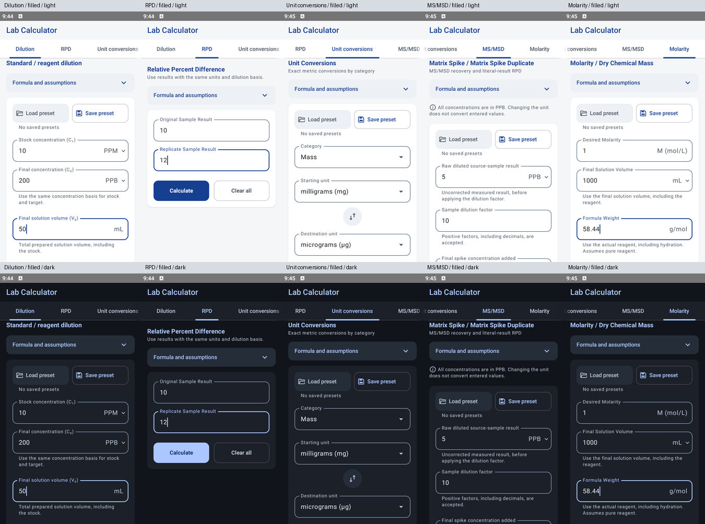

# UI update — September 30, 2026

All five calculators now inherit their input controls, cards, actions, spacing, and colors from shared Compose components. This source update includes the accumulated interface polish since v1.0.2 Preview 1.

## Changes

- **Inputs:** one outlined field style with a floating label replaces the separate bold labels. Dilution retains C₁, C₂, and V₂. Numeric values retain their existing input rules, units, and formatting.
- **Spacing:** shared values provide 16 dp standard gaps, 12 dp within related field groups, and 24 dp between groups and actions. Stock/final concentrations, RPD measurements, molarity/volume, and MS/MSD measurement pairs use the related-field spacing.
- **Themes and type:** the app follows system light/dark mode. Shared semantic colors and 12 dp rounded shapes apply throughout. Supporting text uses Material 3 `bodySmall` and `onSurfaceVariant`, with the default typography metrics and no custom letter spacing.
- **Tabs:** **Unit conversions** keeps its full name. The selected tab scrolls fully into view, with edge fades indicating additional tabs. The molarity tab has the compact title **Molarity**, while its screen retains **Molarity / Dry Chemical Mass**.
- **Unit conversions:** **Swap units** is a centered, circular, 48 dp tonal icon button with a swap-vert icon and an accessible description. Starting unit and Destination unit remain floating labels.
- **MS/MSD:** the default note reads “All concentrations are in PPB. Changing the unit does not convert entered values.” It reflects the selected unit, retains a neutral info icon, and fits within two lines at the checked viewport and font scales.
- **Presets:** shared outlined Save/Load actions replace the earlier text controls. Disabled Load preset has a neutral fill and readable text. Explanations remain in the save dialog. Storage, validation, and preset application are unchanged.
- **Results and reference notes:** results use a shared card outside the input form, with a copy icon and **Copied** feedback. The first result scrolls into view after calculation and keyboard dismissal. Formula/assumption details and calculation steps use expandable headers with animated chevrons. Existing result values, copying content, and saved expansion state are retained.
- **Keyboard and layout:** every calculator uses the shared scroll container, numeric field focus handling, keyboard dismissal, and bottom-inset handling. Calculate and Clear all share sizing and shapes; MS/MSD retains Next sample.
- **Previews:** every tab has empty, filled, error, and result previews in light/dark mode at 360 × 640, with both normal and 1.3× font scale (80 previews).

Calculation engines, unit handling, precision, preset storage, and tab state behavior were not changed. No pass/fail limits or result evaluation were added. The app version and published release APK were not changed by this update.

## Verification

| Check | Result |
| --- | --- |
| Debug app and instrumentation APK builds | Passed |
| Unit tests | 68 passed, no failures or errors |
| Lint | Zero errors; 19 existing dependency, manifest, and unused-resource warnings |
| Android tests, 360 × 640 at 1.3× text | All 17 passed on BlueStacks Android 9 / API 28 |
| Shared UI tests, 360 × 640 at normal text | All 4 passed |
| Visual review | All five tabs, four states, two themes, and both font scales |
| Neutral supporting-text contrast | 6.62–7.56:1 light; 6.94–10.62:1 dark |
| Disabled preset text contrast | 6.66:1 light; 8.06:1 dark |
| Whitespace check | `git diff --check` passed |

Build checks used `gradlew.bat assembleDebug test lint assembleDebugAndroidTest --offline --console=plain` (the Windows wrapper equivalent of `./gradlew`). Android tests ran through ADB with `AndroidJUnitRunner`. Compose recorded the effective 360 dp width and font scale during the runs. Tests check unclipped text, single-line subscript labels, one label per field, two-line PPB/PPM notes, selected-tab visibility and scroll cues, swap dimensions/centering, keyboard behavior, and the existing result/preset/state workflows. The emulator's original display settings were restored.

These checks cover one Android 9 emulator. Physical devices, TalkBack, and other keyboard implementations remain unverified. Detailed historical checks are in [the audit notes](audit.md).

## Screenshots

The filled forms below show the current light/dark UI at 360 × 640 and normal text size. Longer forms scroll; screenshots show their top portion.

Full-size light views: [Dilution](screenshots/dilution-calculator-current.png), [RPD](screenshots/rpd-calculator-current.png), [Unit conversions](screenshots/unit-conversions-current.png), [MS/MSD](screenshots/ms-msd-calculator-current.png), and [Molarity](screenshots/molarity-mass-current.png).
